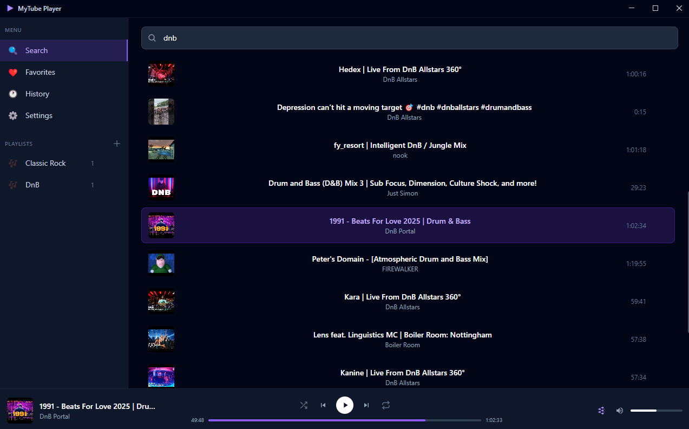

# MyTube Player

A desktop music player powered by YouTube. Search for any song, build playlists, and enjoy your music with a built-in equalizer, all from a clean, modern interface.

[](https://github.com/alinachimmodd/mytube-player/releases/latest)



## Features

- **YouTube Search** - Find any song using YouTube Data API v3
- **Audio Streaming** - High-quality audio via yt-dlp (no video download)
- **Playlists** - Create, reorder, and manage playlists (persisted locally)
- **Favorites** - Quick-save songs you love
- **Playback History** - Automatically tracks what you've listened to
- **10-Band Equalizer** - With 10 presets (Bass Boost, Rock, Pop, Jazz, Electronic, Classical, and more)
- **Shuffle & Repeat** - Shuffle, repeat all, or repeat one
- **Queue Management** - Play next, queue songs from search or playlists
- **Error Logging** - Detailed logs for troubleshooting playback issues

## Download

Grab the latest Windows installer from the [Releases](https://github.com/alinachimmodd/mytube-player/releases/latest) page.

## Setup (takes about 5 minutes)

1. **Download the installer** from [Releases](https://github.com/alinachimmodd/mytube-player/releases/latest) and install it

2. **Get a YouTube API key** (free, takes 2 minutes):
   - Go to [Google Cloud Console](https://console.cloud.google.com/)
   - Create a new project (call it whatever you want)
   - Go to **APIs & Services > Library**, search for **YouTube Data API v3** and enable it
   - Go to **APIs & Services > Credentials**, click **Create Credentials > API Key**
   - **IMPORTANT: Restrict your key!** Click on your new key, then:
     - Under **API restrictions**, select **Restrict key** and pick only **YouTube Data API v3**
     - Under **Application restrictions**, you can set **HTTP referrers** or just leave it on **None** for personal use, but definitely set the API restriction so your key can't be used for anything else if it ever leaks
   - Copy your key

3. Open **MyTube Player**, go to **Settings**, paste your API key, and save

4. That's it, search for a song and vibe!

## Tech Stack

- **Electron 34** - Desktop framework
- **React 19** - UI
- **TypeScript** - Type safety
- **Vite 6** - Build tooling
- **Tailwind CSS** - Styling
- **Zustand 5** - State management
- **Web Audio API** - Equalizer (BiquadFilterNode chain)
- **yt-dlp** - YouTube audio extraction

## Development

```bash
# Install dependencies
npm install

# Run in development
npm run dev

# Build for production
npm run build

# Create Windows installer
npx electron-builder --win
```

Create a `.env` file in the project root:
```
VITE_YOUTUBE_API_KEY=your_api_key_here
```

## License

MIT
